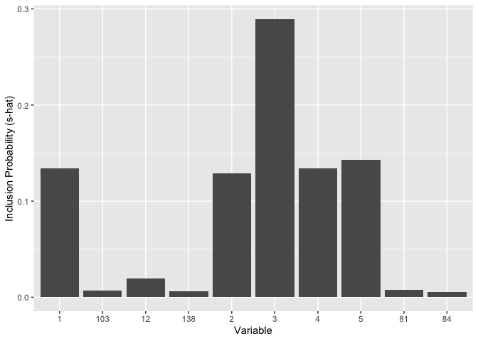

README
================
Lendie Follett, Heath Henderson
3/7/2022

## Setup

To predict two binary outcomes, you will need the `SharedForestBinary`
package, which can be installed via our Github repository using the code
below.

``` r
install.packages("devtools") #install devtools for install_github() function
library(devtools)
repo <-"LendieFollett/Multivariate-Heterogenous-Response-Prediction/SharedForestBinary-master/SharedForestBinary"
install_github(repo)
```

``` r
library(SharedForestBinary)
```

To predict one binary + one continuous outcome, you will need the
`SharedForest` package, which can be installed and loaded similarly.

``` r
install_github("theodds/SharedForestPaper/SharedForest")
```

``` r
library(SharedForest)
```

Other packages you’ll want:

``` r
#install.packages(c("ggplot2", "dplyr"))
library(ggplot2)
library(dplyr)
```

Note that you only need to install once (using the `install...`
functions), but that you need to load (using the `library()` function)
every time you start your R session.

## Binary + Binary Prediction

### Simulate toy dataset

``` r
P = 150 #number of covariates  
n_train = 500 #number of obs in training set
n_test = 500 #number of obs in testing set
d <- array(NA, dim = c(n_train, 2)) #training response
d_test <- array(NA, dim = c(n_test, 2)) #testing response


#Signal parameters
sigma_theta1 <- 4
sigma_theta2 <- 4
f_fun1 <- function(W){10*sin(pi*W[,1]*W[,2]) + 20*(W[,3]- 0.5)^2 + 10*W[,4] + 5*W[,5]}
f_fun2 <- function(W){5*sin(pi*W[,1]*W[,2]) + 25*(W[,3]- 0.5)^2 + 5*W[,4] + 10*W[,5]}

#Simulate training, testing covariate matrices
W <- matrix(runif(P*n_train), ncol = P)
W_test <- matrix(runif(P*n_test), ncol = P)

means <- c(rep(sigma_theta1, n_train), rep(sigma_theta2, n_train))*(cbind(f_fun1(W), f_fun2(W))/20-0.7) 
means_test <-  c(rep(sigma_theta1, n_test), rep(sigma_theta2, n_test))*(cbind(f_fun1(W_test), f_fun2(W_test))/20-0.7)


for (i in 1:n_train){d[i,] <- rnorm(n = 2, mean=means[i,], sd = c(1,1))}
delta1 <- ifelse(d[,1] > 0,1,0)
delta2 <- ifelse(d[,2] > 0,1,0)

for (i in 1:n_test){d_test[i,] <- rnorm(n = 2, mean=means_test[i,], sd =  c(1,1))}
delta1_test <- ifelse(d_test[,1] > 0,1,0)
delta2_test <- ifelse(d_test[,2] > 0,1,0)
```

### Fit model on training

``` r
#Set MCMC parameters
## num_burn = number of iterations discarded as burn-in
## num_thin = thinning parameter 
## num_save = number of iterations to save after burn-in
opts <- SharedForestBinary::Opts(num_burn = 500, num_thin = 1, num_save = 500, num_print = 1000)
hypers <- SharedForestBinary::Hypers(W = W, #Training covariate matrix
                 delta1 = delta1, #first binary response vector
                 delta2 = delta2, #second binary response vector
                 num_tree = 100) #number of trees (100-200 should be sufficient)

#BART with shared forest model
sb <- SharedBartBinary(W = W, #Training covariate matrix
           delta1=delta1, #first binary response vector
           delta2=delta2, #second binary response vector
            W_test=W_test, #Testing covariate matrix
           hypers_ = hypers, #hypers from above
           opts_ = opts) #opts from above
```

    ## Finishing warmup BLAH 0      
    ## Finishing save 0     
    ## Number of leaves at final iterations:
    ## 2 2 3 2 2 2 2 2 4 2 
    ## 3 3 3 2 2 2 2 2 3 2 
    ## 3 2 2 2 2 2 2 3 2 2 
    ## 2 4 3 2 2 2 2 2 4 3 
    ## 2 2 3 2 3 2 4 2 4 3 
    ## 2 2 4 3 2 3 3 2 3 2 
    ## 2 1 2 3 3 2 2 4 3 2 
    ## 2 2 5 3 2 2 3 2 2 2 
    ## 2 2 2 2 2 2 2 1 4 4 
    ## 2 3 2 4 3 2 2 3 2 3

### Predict on test data

``` r
#Predict delta1 (conditioning binary variable)
delta_star <- (sb$theta_hat_test1 %>%
                 apply(1:2, function(x){rbinom(n = 1, size = 1, prob = pnorm(x))}))

#Conditional on delta1 above, predict delta2
#estimated P(delta2 = 1 | delta1 = 1)
sb_y_pred1 <- mean(apply(delta_star*sb$theta_hat_test2, 1, sum) / apply(delta_star, 1, sum)) %>% pnorm()
#estimated P(delta2 = 1 | delta1 = 0)
sb_y_pred0 <- mean(apply((1-delta_star)*sb$theta_hat_test2, 1, sum) / apply((1-delta_star), 1, sum)) %>% pnorm()
```

### OPTIONAL: see which variables are most important

``` r
s_hat <- sb$s %>%apply(2, mean)
vars <- as.character(1:ncol(W)) #In real application, replace with column names
s_dat <- data.frame(vars, s_hat)

s_dat %>%
  top_n(10, s_hat) %>% #Plot only top 10 variables
  ggplot() + geom_bar(aes(x = vars, y = s_hat), stat = "identity") +
  labs(x = "Variable", y = "Inclusion Probability (s-hat)") 
```

<!-- -->

## Binary + Continuous Prediction

### Simulate toy dataset

Note: It is beneficial to standardize the continuous response (both
training and testing) before feeding to the model. Be sure to use the
mean and standard deviation of the *training* data set in order to
standardize the test response!

``` r
P = 150
n_train = 500
n_test = 500

d <- array(NA, dim = c(n_train, 2))
d_test <- array(NA, dim = c(n_test, 2))

sigma_theta <- 4

# Define helper functions
f_fun1 <- function(W){10*sin(pi*W[,1]*W[,2]) + 20*(W[,3]- 0.5)^2 + 10*W[,4] + 5*W[,5]}
f_fun2 <- function(W){5*sin(pi*W[,1]*W[,2]) + 25*(W[,3]- 0.5)^2 + 5*W[,4] + 10*W[,5]}
W <- matrix(runif(P*n_train), ncol = P)
W_test <- matrix(runif(P*n_test), ncol = P)
    
# Generate expected values
means <-       cbind(f_fun1(W),      sigma_theta*(f_fun2(W)/20 - 0.7))
means_test <-  cbind(f_fun1(W_test), sigma_theta*(f_fun2(W_test)/20 - 0.7))
    
# Generate training outcomes
for (i in 1:n_train){d[i,] <- rnorm(n = 2, mean = means[i,], sd = c(1,1))}
Y <- (d[,1] - mean(d[,1]))/ sd(d[,1])
delta <- ifelse(d[,2] > 0, 1, 0)

# Generate testing outcomes
for (i in 1:n_test){d_test[i,] <- rnorm(n = 2, mean = means_test[i,], sd = c(1,1))}
# Standardize using training summary statistics
# (Predicting how many training sd's above or below training mean test set obs falls)
Y_test <- (d_test[,1] - mean(d[,1]))/ sd(d[,1])
delta_test <- ifelse(d_test[,2] > 0, 1, 0)
```

### Fit model on training

``` r
# Set up for simulations
opts <- Opts(num_burn = 500, num_thin = 1, num_save = 500, num_print = 1000)

# Shared forest model
hypers <- SharedForest::Hypers(X = W, Y = Y, W = W, delta = delta, num_tree = 100)

sb  <- SharedBart(X = W, #Training covariate matrix for continuous response
                  Y = Y, #Training continuous response (standardized)
                  W = W, #Training covariate matrix for binary response (likely the same as X)
                  delta = delta, #Training binary response
                  X_test = W_test, #Testing X
                  W_test = W_test, #Testing X
                  hypers_ = hypers, opts_ = opts)
```

    ## Finishing warmup 0       
    ## Finishing save 0     
    ## Number of leaves at final iterations:
    ## 4 3 3 1 2 2 2 3 2 2 
    ## 3 3 1 2 2 4 2 3 2 2 
    ## 3 3 2 5 2 2 3 2 4 2 
    ## 2 2 2 2 2 2 2 2 3 2 
    ## 2 2 3 2 2 2 3 2 2 2 
    ## 2 3 2 2 2 3 3 2 5 3 
    ## 3 2 3 5 3 3 4 3 2 2 
    ## 3 2 2 5 2 2 2 2 2 2 
    ## 2 3 3 2 2 4 3 2 2 2 
    ## 2 3 2 2 2 2 2 2 3 2

### Predict on test data

``` r
# Generate binary predictions for test
delta_star <- (sb$theta_hat_test %>%
                 apply(1:2, function(x){rbinom(n = 1, size = 1, prob = pnorm(x))}))
#Estimate E(Y | delta = 1)
sb_y_pred1 <- mean(apply(delta_star*sb$mu_hat_test, 1, sum) / apply(delta_star, 1, sum))
#Estimate E(Y | delta = 0)
sb_y_pred0 <- mean(apply((1-delta_star)*sb$mu_hat_test, 1, sum) / apply((1-delta_star), 1, sum))
```
